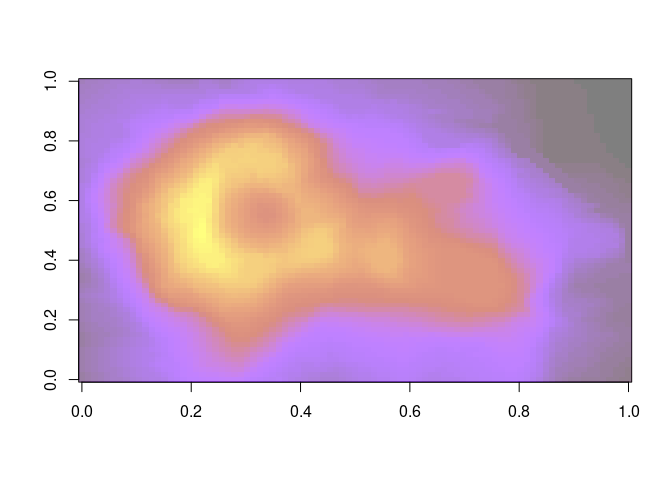
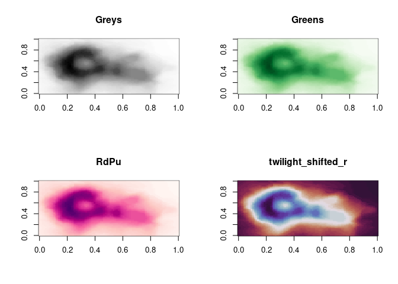

<!-- README.md is generated from README.Rmd. Please edit that file -->

# cmap

<!-- badges: start -->

[](https://github.com/mdsumner/cmap/actions/workflows/R-CMD-check.yaml)
<!-- badges: end -->

The goal of cmap is to provide colours from matplotlib.

## Installation

You can install the development version of cmap like so:

``` r
pak::pkg_install(file.path("mdsumner", "cmap"))
```

## Example

This is a basic example which shows you how to solve a common problem:

``` r
library(cmap)
pal <- cm_pal("gnuplot")
image(volcano, col = pal(100, alpha = 0.5))
```



``` r

par(mfrow = n2mfrow(4))
for (i in 1:4) {
image(volcano, col = cm_pal(nm <- sample(cm_names(), 1))(64), main = nm)
}
```



You can also use the cm object itself, but we haven’t thought about that
much yet.

``` r
cmap:::cm$brg(seq(0, 1,length.out = 5))
#>           [,1]        [,2]      [,3] [,4]
#> [1,] 0.0000000 0.000000000 1.0000000    1
#> [2,] 0.5019608 0.000000000 0.4980392    1
#> [3,] 0.9960784 0.003921569 0.0000000    1
#> [4,] 0.4941176 0.505882353 0.0000000    1
#> [5,] 0.0000000 1.000000000 0.0000000    1
```

## Code of Conduct

Please note that the cmap project is released with a [Contributor Code
of
Conduct](https://contributor-covenant.org/version/2/1/CODE_OF_CONDUCT.html).
By contributing to this project, you agree to abide by its terms.
